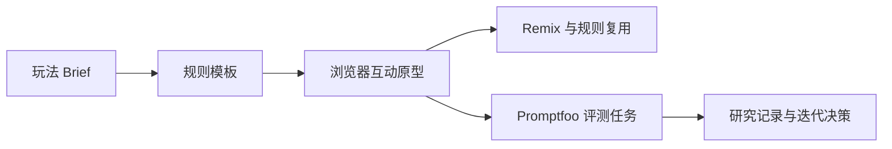

<p align="center">
  
</p>

<h1 align="center">LivePlay Lab</h1>

<p align="center">
  面向直播与活动组织者的 AI 互动玩法工作台：将玩法 Brief 转换为可运行的浏览器原型、可 Remix 的规则模板，以及可用 Promptfoo 回归的 Coding Agent 评测集。
</p>

<p align="center">
  
  
  
</p>

<p align="center">
  <a href="#产品闭环">产品闭环</a> · <a href="#核心能力">核心能力</a> · <a href="#快速开始">快速开始</a> · <a href="#评测与研究">评测与研究</a> · <a href="#文档导航">文档导航</a>
</p>

> 仓库已经交付可运行产品、3 个玩法模板、50 条评测任务和研究记录工具。真实访谈、无引导测试、模型评测与 V2 发布数据均保持“待执行”，不伪造证据。

## 产品闭环



直播互动玩法往往停在文案或一次性脚本，难以被复用、演示与验证。LivePlay Lab 将“规则模板 → 可运行微应用 → 评测任务 → 研究记录”连成可追溯的产品闭环，帮助组织者和产品团队回答：

1. 玩法能否快速被做成可演示的浏览器原型？
2. 生成它的 Coding Agent 能否处理需求歧义、状态、异常与安全边界？
3. 主持人能否在同一套规则上复用、改造并验证效果？

## 核心能力

| 能力 | 说明 |
| --- | --- |
| **玩法工作台** | 输入主题、目标、受众、时长与边界，生成候选互动方案。 |
| **规则模板与 Remix** | 内置关键词拼图、限时真知题、任务接力赛三种模板；方案可保存为本机变体并在刷新后重新加载。 |
| **浏览器微应用预览** | 可点击、可反馈，并验证重复提交锁定等关键交互状态。 |
| **模型接入** | 可选任意 OpenAI 兼容端点，经本机代理调用；API Key 不进入 Git 或 localStorage。 |
| **Coding Agent 评测** | 50 条 Promptfoo 用例覆盖需求理解、代码生成、自验证、安全与体验。 |
| **用户研究工具** | 提供 5 个探索访谈与 5 个无引导测试的真实记录位和操作包。 |

## 快速开始

```powershell
npm install
npm run dev
```

打开 Vite 输出的地址，默认是 `http://localhost:5173`。本地方案无需网络或 API Key。

### 使用真实模型 API

```powershell
Copy-Item .env.example .env
# 编辑 .env，填写兼容端点、模型名和 API Key
npm run server
```

在网页右上角“模型 API”中启用“使用模型方案”。密钥只用于当前调用；不要提交 `.env`。

### 质量检查

```powershell
npm run test
npm run lint
npm run build
```

## 评测与研究

配置评测所需的模型环境变量后运行：

```powershell
$env:OPENAI_API_KEY = '...'
$env:OPENAI_BASE_URL = 'https://your-provider.example/v1'
npx promptfoo@latest eval -c evals/promptfooconfig.yaml
```

评测结果应保存为一次真实运行的导出物；仓库不预置或伪造通过率。研究结论也只应在获得参与者同意、完成原始记录后写入作品集。

## 文档导航

| 文档 | 内容 |
| --- | --- |
| [`docs/00-product-overview.md`](docs/00-product-overview.md) | 产品定位、范围与创新点 |
| [`docs/01-prd.md`](docs/01-prd.md) | MVP PRD、流程与验收 |
| [`docs/02-figma-flow.md`](docs/02-figma-flow.md) | 可在 Figma 复画的流程与节点 |
| [`docs/03-research-package.md`](docs/03-research-package.md) | 招募、访谈、同意与分析包 |
| [`docs/04-evaluation-plan.md`](docs/04-evaluation-plan.md) | Promptfoo 运行和失败分类 |
| [`docs/05-worklog.md`](docs/05-worklog.md) | 六周工作日志、反思与工具 |
| [`docs/06-operations.md`](docs/06-operations.md) | 本地运行、操作、录屏和发布步骤 |
| [`docs/07-portfolio-case.md`](docs/07-portfolio-case.md) | 作品集案例叙事 |
| [`docs/08-demo-recording-script.md`](docs/08-demo-recording-script.md) | 五分钟演示脚本 |
| [`docs/09-user-test-template.md`](docs/09-user-test-template.md) | 无引导测试记录模板 |

## 项目边界

- 这是独立浏览器演示，不连接抖音、淘宝、拼多多、腾讯或任何真实直播平台。
- 不收集真实用户身份或支付信息。
- 第三方 API 的条款、价格和数据处理规则由使用者自行确认。

## License

MIT. See [LICENSE](LICENSE).
