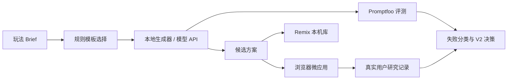

# LivePlay Lab｜产品概览

**产品一句话：** 把直播/活动玩法 Brief 变成可运行浏览器微应用，并用规则模板、评测集和研究记录让方案可复用、可验证。

## 1. 产品机会

直播与校园活动的互动策划常见断点是：策划案能写，但主持人无法快速试跑；AI 能生成文案，但不一定理解时间、人力、体验和安全边界；上线后又没有办法说明失败究竟来自需求理解、代码生成，还是自验证缺失。LivePlay Lab 将产物缩小为一个可点击的浏览器微应用，再把生成过程放进结构化评测。

## 2. 核心用户与场景

| 用户 | 典型任务 | 当前阻力 | LivePlay Lab 的回应 |
| --- | --- | --- | --- |
| 校园活动组织者 | 12 分钟内设计迎新互动 | 规则容易复杂，主持人难照着执行 | 提供时长、人力、受众约束下的结构化方案与口播 |
| 直播运营/内容创作者 | 验证一个互动想法是否能跑通 | 一次性文案无法展示真实反馈 | 直接预览可点击的浏览器微应用 |
| AI 产品/原型实践者 | 判断 Coding Agent 是否可靠 | 只看“生成成功”无法定位失败 | 50 条分类任务和人工复核状态 |

## 3. 产品结构

## 4. 独创性与边界

**独创性：** 不把“AI 生成活动方案”作为终点，而把“可复用规则 + 可运行状态机 + 可观测失败分类”设为同一产品的三个层级。每条候选玩法天然附带 Coding Agent 实现 Brief 和风险点，使产品判断可被工程验证。

**边界：**
- 当前是独立浏览器演示，未接入任何直播平台、账号、支付、私信或真实用户数据。
- 本地生成器用于无密钥演示；真实模型只在使用者配置兼容 API 后通过本机服务调用。
- 访谈、无引导测试、Promptfoo 真实运行和发布数据未执行时，均保持“待执行”。

## 5. 版本状态（2026-08-10）

| 能力 | 状态 | 证据 |
| --- | --- | --- |
| 玩法工作台与本地方案 | 已完成 | `src/App.tsx`、`src/lib/generation.ts` |
| 三个规则模板与 Remix | 已完成 | `src/data.ts`、本机 localStorage |
| 浏览器互动微应用 | 已完成 | 工作台右栏，可点击验证反馈 |
| OpenAI 兼容模型代理 | 已完成，待配置密钥 | `server/index.mjs`、`.env.example` |
| 50 条 Promptfoo 任务 | 已完成，待真实运行 | `evals/promptfooconfig.yaml` |
| 5 人访谈与 5 人无引导测试 | 待执行 | `docs/03-research-package.md`、`docs/09-user-test-template.md` |
| V2 发布、录屏与作品集结果 | 待执行 | `docs/06-operations.md`、`docs/08-demo-recording-script.md` |

## 6. 成功定义

在真实研究开始前，这些是**待验证指标**而非结果：
- 新用户在无引导下完成“选择模板 -> 生成 -> 预览 -> 保存 Remix”的完成率。
- 用户主动编辑 Brief 或规则的比例，用于判断方案是否可控而非黑盒。
- Promptfoo 四类失败中，需求理解、自验证、安全体验三类的严重失败占比。
- 主持人能否在不额外解释的情况下，把候选方案改成一段可用口播。
