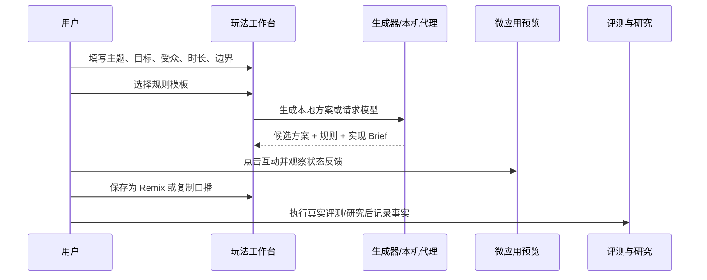

# LivePlay Lab MVP PRD

| 字段 | 内容 |
| --- | --- |
| 版本 | MVP 0.1 |
| 产品负责人 | 独立产品实践者 |
| 文档状态 | 可执行；用户研究与线上数据待补 |
| 范围 | 浏览器端互动方案生成、预览、Remix、评测与研究工具 |

## 1. 问题与目标

**问题：** 直播/活动互动策划在“想法 -> 可演示原型 -> 可复用规则 -> 可靠性验证”之间断裂，导致 AI 输出难以复审，活动组织者也难以直接试跑。

**MVP 目标：** 让用户在一次浏览器会话内，输入一个 Brief，选择一个模板，拿到可编辑候选方案并在可点击微应用中验证主互动；同时把生成质量纳入 50 条任务的可复跑评测。

**非目标：** 不做真实平台直播推流、账户授权、评论抓取、支付、用户画像、真实排行榜或自动发布。

## 2. 用户故事与验收

| 优先级 | 用户故事 | 验收标准 |
| --- | --- | --- |
| P0 | 作为活动组织者，我要输入主题和边界，快速获得一个可执行玩法 | 主题与目标为空时阻止生成；方案含摘要、规则、口播、实现 Brief、风险点 |
| P0 | 作为原型实践者，我要看到玩法是否真的有交互反馈 | 三模板均可切换；主按钮只能提交一次；操作后出现进度或积分反馈 |
| P0 | 作为用户，我要在无密钥时也能试用 | 默认本地生成；断网可生成；模型失败时保留本地草案 |
| P0 | 作为 AI 产品实践者，我要接入真实模型 | OpenAI 兼容端点、模型、Key 可配置；Key 不落 localStorage/Git |
| P1 | 作为组织者，我要把有效方案保存为下次可用的变体 | 保存名称、来源模板、规则；刷新后可在 Remix 库恢复 |
| P1 | 作为评测者，我要复核 50 个任务 | 可筛选四类任务；可手动标记已复核；实际运行结果不预填 |
| P1 | 作为研究员，我要招募并记录真实参与者 | 提供招募、同意、访谈和无引导测试表；不假造样本结论 |

## 3. 端到端流程

## 4. 信息架构

1. **玩法工作台：** 三栏结构，依次是 Brief、候选方案、微应用预览。核心操作不超过一次滚动。
2. **模板与 Remix：** 三个预置模板的适用范围、核心规则和本机变体。
3. **评测与负例：** 50 条任务，按需求理解、代码生成、自验证、安全与体验分组。
4. **用户研究：** 5 个访谈与 5 个无引导测试的空记录位，绑定研究操作包。
5. **作品集证据：** 所有材料的入口和状态边界。

## 5. 关键规则

### 5.1 本地方案生成

输入字段做空值回退，但点击生成时主题与目标必须存在。生成结构固定为：`title`、`summary`、`rules[]`、`hostScript`、`visualPrompt`、`riskNotes[]`、`codeBrief`。这样可以使本地方案和模型方案共用同一渲染与评测接口。

### 5.2 模型 API

- 协议：OpenAI-compatible `/chat/completions`。
- 路径：浏览器 -> `http://localhost:8788/api/generate` -> 厂商端点。
- 密钥：仅存在 React state 或本机 `.env`；`.env` 在 Git ignore 内。
- 异常：服务不存在、401、非 JSON、字段残缺时，提示原因并保留本地方案。

### 5.3 模板规则

| 模板 | 触发条件 | 主动作 | 即时反馈 | 设计边界 |
| --- | --- | --- | --- |
| 关键词拼图 | 主题有可拆线索 | 弹幕/选项补词 | 锁定线索与积分 | 防止答案过宽、避免刷屏 |
| 限时真知题 | 有可验证事实 | 真/假单选 | 倒计时、解释、连胜 | 题干无歧义、仅一次作答 |
| 任务接力赛 | 有共同目标 | 加入一棒 | 全场进度推进 | 单步动作、阈值清晰、不过度收集信息 |

## 6. 埋点与研究口径（待执行）

不接第三方分析 SDK；真实测试时由观察员记录以下事件：

| 事件 | 属性 | 用途 |
| --- | --- | --- |
| `brief_started` | 是否修改默认值 | 判断用户是否理解输入项 |
| `plan_generated` | 本地/模型、模板 | 记录生成路径 |
| `prototype_interacted` | 模板、是否成功 | 验证可点击主路径 |
| `remix_saved` | 模板、规则数 | 观察复用意愿 |
| `blocked` | 步骤、失败原因 | 形成 V2 优先级 |

## 7. 发布门槛

- `npm run test`、`npm run lint`、`npm run build` 通过。
- 桌面和 375px 宽度完成输入、生成、切换、互动、保存、刷新恢复和异常回退。
- 模型 API、Promptfoo、访谈和无引导测试完成后，保存原始记录、去标识化摘要及复盘；没有这些记录不得声称已验证效果。
