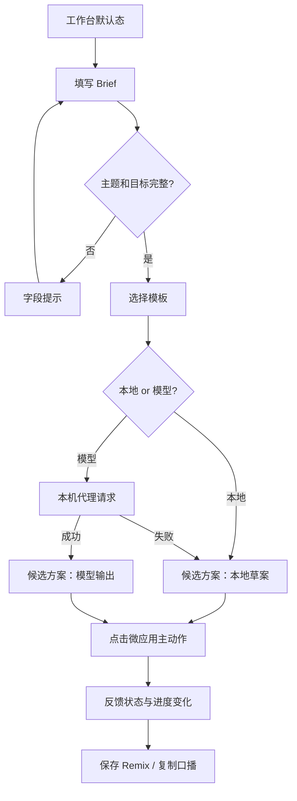

# 原型流程与 Figma 复画说明

当前代码产品是可运行原型；本文件给出在 Figma 中复画和审阅同一交互的页面结构。这样作品集既能展示流程判断，也能由面试官回到可运行 Demo 验证。

## 1. 页面清单

| 页面/Frame | 尺寸 | 目标 | 关键组件 |
| --- | --- | --- | --- |
| A. 工作台 Desktop | 1440 x 1024 | 完成主路径 | 深色侧栏、三栏工作区、微应用预览 |
| B. 工作台 Mobile | 375 x 900 | 验证移动操作 | 抽屉导航、单列分段、主按钮 |
| C. 模板与 Remix | 1440 x 900 | 选择或恢复规则 | 三模板卡、变体列表、空状态 |
| D. 评测与负例 | 1440 x 1024 | 扫描 50 条用例 | 筛选 chips、表格、复核状态 |
| E. API 配置弹窗 | 480 x 560 | 配置兼容模型 | Base URL、模型、密码字段、会话提示 |

## 2. 组件规范

| 组件 | 规则 |
| --- | --- |
| 页面网格 | Desktop 侧栏 242px；主区为 Brief / 方案 / 预览三栏；1110px 以下将预览移至第二行 |
| 主按钮 | 深绿填充，最小高 36px；加载时禁用，文案变为“正在组织方案...” |
| 模板项 | 色条 + 名称 + 短标签；选中时显示浅绿背景和边框 |
| 候选方案 | 固定呈现 4 组：规则、口播、实现 Brief、风险与验证点 |
| 演示微应用 | 深色中性皮肤；不使用任何平台 Logo、色板或真实用户内容 |
| API Key | `password` 类型；不做“记住我”；文案说明不写 localStorage |

## 3. 原型连线

## 4. 关键交互注释

1. 选择模板只改变当前模板和预览状态，不自动覆盖用户已经生成的方案；点击“生成”才让候选方案跟随新的 Brief 和模板重算。
2. 模型请求失败后立即渲染本地草案。该降级策略避免用户丢失输入，也不把失败伪装为模型成功。
3. 微应用主按钮作答后锁定。真知题只对“真”累积分数，这是刻意可见的状态规则，便于测试 Coding Agent 是否正确处理一次性提交。
4. 保存 Remix 存的是名称、来源模板和规则，不保存 API Key、访谈信息或真实平台数据。
5. 评测“已复核”是人工标记，不等同于通过率。Figma 里应使用“待复核/已复核”，而不是成功率视觉暗示。

## 5. 可用性检查清单

- 375px 宽度时不出现横向滚动；文本可换行；所有按钮可触达。
- 任何关键操作都由文字而非仅颜色表达。
- 失败提示明确给出下一步，不显示 Key 或上游原始响应。
- 视觉仅使用原创中性组件，不仿冒第三方直播产品。
