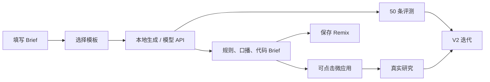

# 作品集案例｜LivePlay Lab

## 标题

**LivePlay Lab：把直播互动玩法转成可运行 AI 轻应用，并用 50 条任务评测 Coding Agent 的可靠性**

## 一句话简介

我设计并实现了一个面向直播与校园活动组织者的浏览器工作台。用户把活动主题、目标、受众、时长和资源边界写成 Brief，选择玩法模板后，可以得到可编辑的规则、主持人口播、Coding Agent 实现 Brief 和一个可点击微应用。产品同时提供 Remix 库、Promptfoo 评测集以及用户研究记录工具。

## 背景与判断

我观察到 AI 做活动策划时容易生成看似完整但无法直接运行的内容：它可能忽略时长和人力，没定义互动状态，也没有异常与安全边界。另一个问题是，产品/原型岗位不仅需要“能做 Demo”，还需要说明 Coding Agent 失败在何处、如何回归。

因此我把首版产品定义为四层：

1. **规则层：** 三种可复用模板，每条规则都包含触发、动作、反馈和边界。
2. **体验层：** 在浏览器中展示可点击的互动状态，验证用户能看见一次性提交和即时反馈。
3. **可靠性层：** 50 条任务按需求理解、代码生成、自验证、安全体验分类，避免只评价“文案好不好”。
4. **证据层：** 用研究操作包收集真实访谈和无引导测试，并明确不把计划写成数据。

## 我做了什么

| 阶段 | 主要产出 | 我的关键决策 |
| --- | --- | --- |
| 问题界定 | 产品概览、用户故事、非目标 | 不接真实平台 API，先验证玩法和 Agent 产物的闭环 |
| 规则设计 | 拼图、真知题、接力赛三模板 | 将“好玩”拆成低门槛参与、明确反馈、可控节奏 |
| 原型实现 | React 三栏工作台、本地生成器、微应用状态 | 默认离线可跑，API 失败也保留可演示草案 |
| 模型能力 | 本机 OpenAI-compatible 代理 | API Key 仅在会话/本机 `.env` 中，不保存或提交 |
| 质量评测 | 50 条 Promptfoo 用例与失败分类 | 把虚构证据、密钥泄露、仿冒平台也作为失败类型 |
| 研究设计 | 招募、访谈、无引导任务、观察表 | 真实研究未完成时保留待执行，不写假样本 |

## 核心流程

## 设计细节

- **可控而非纯生成：** 先选模板后生成，用户可以通过时长、人力和边界控制方案。模板的规则是可见的，候选方案也支持复制和 Remix。
- **真实可运行：** 右侧微应用不是图片。真知题会锁定作答；其他模板会反馈已参与并推进展示进度。
- **失败可见：** 模型服务不可用时，界面不会显示“生成成功”，而是回退到明确标识的本地草案。
- **安全作为产品需求：** Key 不进 localStorage；不收集真实用户数据；所有演示皮肤是中性原创视觉，不暗示平台接入。

## 结果与当前证据

**已可复审：** 可运行源码、三模板、本地生成与 API 代理实现、单元测试、50 条评测配置、研究操作包、演示脚本。

**待执行：** 5 位有直播/活动组织经验者的访谈、5 位新用户的无引导测试、真实模型的 Promptfoo 运行、V2 对比数据和最终录屏。完成前我不会在项目中填写通过率、完成率或“提升”数字。

## 下一步

1. 按研究包完成 5+5 人研究并把失败点编码。
2. 用真实模型跑完 50 条评测，优先修复 ST 与主路径中的严重 RQ/CG/SV 问题。
3. 基于证据收敛 V2，录制包含主路径和失败回退的五分钟演示。
